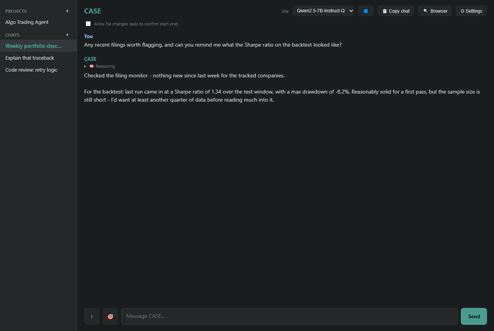
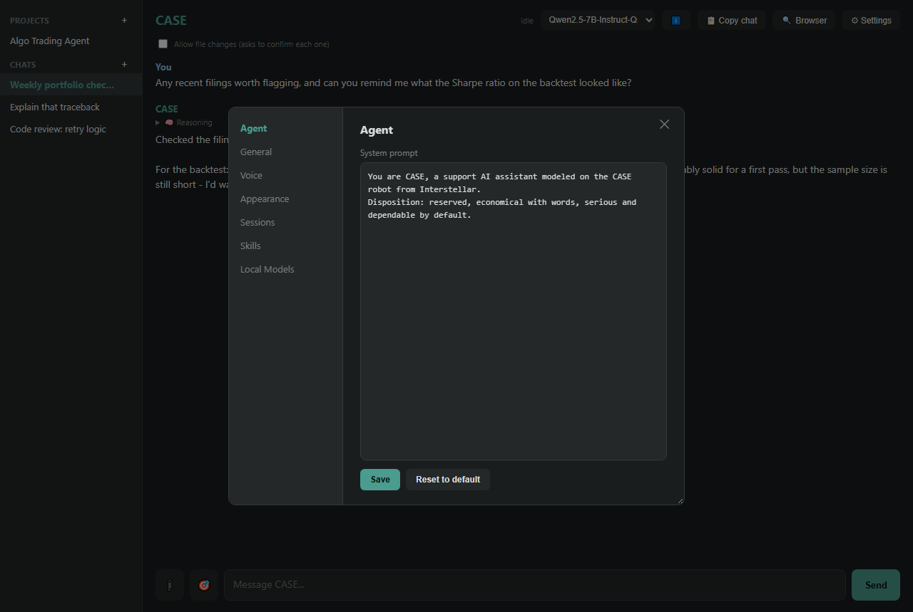
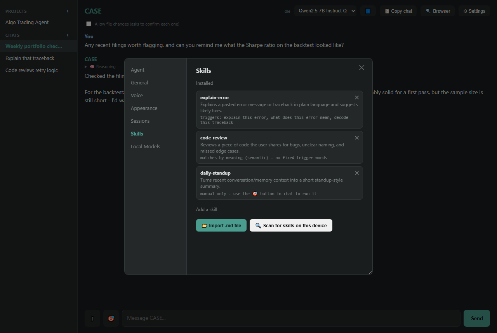
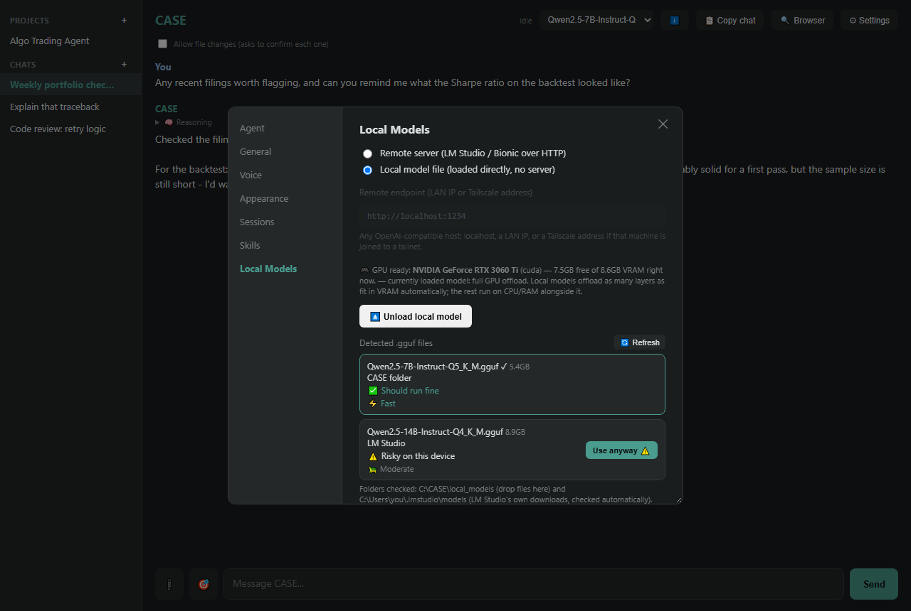

# CASE

A local AI assistant, modeled on the CASE robot from *Interstellar* — a quieter
companion to [Claude Code](https://claude.com/claude-code) (nicknamed "TARS" by
its author), built as a local fallback for when Claude Code or the Anthropic API
is unavailable. Runs against either a remote OpenAI-compatible endpoint (LM
Studio, Bionic, or anything similar over HTTP) or a local `.gguf` model file
loaded directly via `llama-cpp-python` — no server required either way.

**Status: work in progress.** This is a personal project shared as-is. Expect
rough edges, incomplete platform support, and breaking changes without notice.

|                                                    |                                                                  |
| -------------------------------------------------- | ---------------------------------------------------------------- |
|                        |                |
| Chat, with a collapsible reasoning block             | Settings > Agent - personalize the system prompt                  |
|  |   |
| Settings > Skills - the 3 example skills, one per matching mode | Settings > Local Models - GPU detection + a per-file fit/speed check |

(Sample conversation shown for illustration - not a real chat log.)

## What's here

- `case_gui_web.py` / `case_gui_web.html` — the desktop GUI (pywebview):
  chats with real history/projects, a model info popover, session storage
  and retention settings, voice input/output, and a Skills tab.
- `case_cli.py` — a plain terminal client (read-only, no write/delete tools -
  see below for why), also the basis for the Android/Termux client. See
  [ANDROID_SETUP.md](ANDROID_SETUP.md) for running CASE from a phone -
  either as a thin client to a PC's model over the LAN, or fully standalone
  with `llama-cpp-python` running a `.gguf` model directly on the phone
  (CPU-only by default; there's an experimental, narrower GPU-offload path
  for Qualcomm Adreno chips - see that doc for the real, current caveats).
- `case_agent.py` / `case_tools.py` / `case_write_tools.py` — the actual
  agent loop: tool-calling, file read/write (gated behind a real confirmation
  prompt, with automatic backups and an undo tool), memory search, web
  search, a browser tool, and an optional delegated subagent.
- `case_skills.py` — lightweight, per-install skills (markdown + YAML
  frontmatter). Three matching modes: keyword (explicit trigger phrases),
  semantic (local embedding similarity, no triggers needed), and manual
  (never auto-fires, invoked on demand). Can also import skills already on
  disk in Claude Code's own `SKILL.md` format. `skills/example-*.md` has
  one of each mode to try out of the box.
- `case_local_llm.py` / `case_hardware.py` — local GGUF inference via
  llama-cpp-python, with GPU-offload/context-size auto-backoff and
  best-effort hardware detection (NVIDIA, Apple Silicon, Android/Adreno).

Everything here is deliberately dependency-light and file-based (JSON/
markdown on disk) - no database, no cloud account required to run it.

## Hardware requirements

There's no fixed minimum - it depends entirely on which backend you use:

- **Remote backend** (talking to LM Studio, Bionic, or any OpenAI-compatible
  server over HTTP): CASE itself is lightweight either way - the actual
  model runs wherever that server is, so CASE's own requirements are
  trivial (a few hundred MB RAM, no GPU needed).
- **Local backend** (a `.gguf` file loaded directly, no server): RAM is the
  real constraint - `case_hardware.py` checks the device's actual free RAM
  against the model file's size before you load it and warns if it's a
  poor fit, rather than letting you find out the hard way. A GPU (NVIDIA
  via CUDA, Apple Silicon via Metal) speeds this up a lot but isn't
  required - CPU-only inference works, just slower. On Android specifically,
  this same local-backend path runs directly on the phone; see
  [ANDROID_SETUP.md](ANDROID_SETUP.md) for real numbers and the current
  GPU-offload caveats there.
- **Voice** (optional): adds `faster-whisper` + `torch`, which pulls in a
  real download and more RAM/disk regardless of backend choice - only
  install this if you actually want voice input/output.

## Setup

Requires Python 3.10+. `requirements.txt` is tiered - the only uncommented
line is `pywebview` (needed for the GUI; the terminal client needs nothing
beyond stdlib at all). Uncomment the lines for whichever of the local
backend / semantic skill matching / voice you actually want, then:

```
pip install -r requirements.txt
```

Then either:
- **GUI**: `python case_gui_web.py` (Windows: `launch_case.vbs` starts it
  without a console window; on Linux, pywebview needs a system GTK or QT
  WebKit backend installed first - on Debian/Ubuntu, GTK is the simpler
  option: `sudo apt install python3-gi python3-gi-cairo gir1.2-gtk-3.0
  gir1.2-webkit2-4.1` (see [pywebview's own install
  docs](https://pywebview.flowrl.com/guide/installation.html) for other
  distros/QT); on macOS it uses Cocoa/WKWebView, nothing extra needed)
- **Terminal**: `python case_cli.py` (works the same on Windows/Linux/
  macOS - no GUI dependencies at all)
- **Android (Termux)**: see [ANDROID_SETUP.md](ANDROID_SETUP.md) - either
  as a thin client to a PC's model over the LAN, or fully standalone with
  a local `.gguf` model on the phone itself

On first run, CASE has no personal configuration at all - it uses generic
defaults everywhere. Go to **Settings > Agent** to set your own system
prompt (who you are, what you're working on, how you like answers phrased).
Nothing needs to be edited in source to personalize it.

## Personalize, don't fork the prompt into the repo

`case_config.json` (your system prompt override, model choice, endpoints),
`case_sessions/` (chat history), `case_backups/`, and `skills/` are all
gitignored on purpose - they're supposed to be personal to your own install,
not shared. If you're contributing changes back, keep them out of your
diffs the same way.

## If you find this useful

This is a side project, not the main thing being sold here - if CASE (or the
approach behind it) was useful to you, the best way to say thanks is picking
up one of the books that came out of this same body of work:

- [*A Guide to Claude Code: The Creator's Playbook*](https://www.amazon.co.uk/Guide-Claude-Code-Creators-Playbook/dp/B0H55M69NX)
- [*ChatGPT Power User Playbook*](https://www.amazon.co.uk/ChatGPT-Power-User-Playbook-Automation/dp/B0H5VR97JG)
- [*Don't Just Trust It — A Teen's Guide to Thinking Clearly About AI*](https://www.amazon.com/dp/B0H8ZWRCWB)
- [*Smarter, Not Faster* — a teen's guide to AI productivity](https://www.amazon.com/dp/B0H96NXQ9G)

No pressure either way - just where to look if you want more.
